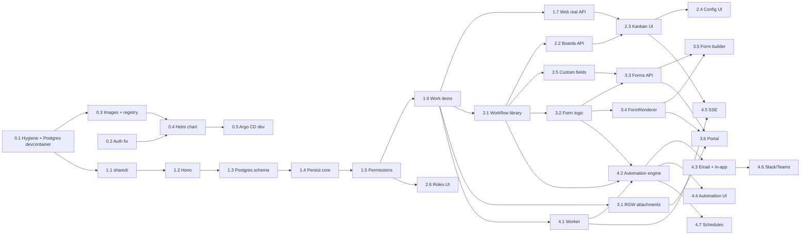

# Fira — Implementation Plan

_Status: revised 2026-10-08 after review answers. Based on `copilot/devcontainer-setup` (`d460677`)._

This document looks at where the repository stands today. It sets out how Fira gets from there to a work-item platform with shared configurable workflows, boards, permissions, a service portal with rich forms, and an automation layer, running on the team's k3s cluster. It then breaks that work into a sequence of reviewable PRs.

---

## 1. Target capabilities

| # | Capability | Summary |
|---|---|---|
| C1 | Project spaces | Projects that contain work items (with types, hierarchy and links) |
| C2 | Boards | One or more kanban boards per project, each a configurable view over the project's items |
| C3 | Workflow movement | Users move items between columns, and each move is a validated workflow transition |
| C4 | Configurable, shared workflows | A library of workflows that many projects reuse, mapped per work-item type |
| C5 | Permissions | Users have different capabilities, set per project and system-wide |
| C6 | Persistence | Every user change is saved in the database. Nothing lives in memory only |
| C7 | Service portal | Logged-in users submit forms, and each submission creates a work item in the target project |
| C8 | Rich forms | Per-project forms with attachments, dropdowns, conditional logic and validation |
| C9 | Automation | Triggers (form submitted, item transitioned, field changed…) run rules that act on items in the same project |
| C10 | Notifications | Email via the existing SMTP relay and in-app notifications, with optional Slack/Teams channels |
| C11 | Deployment | Runs on k3s, delivered by a Helm chart managed by Argo CD |

---

## 2. Current state assessment

### 2.1 What exists

- **Stack:** a Bun + TypeScript API, a Vue 3 + Pinia + Vue Router SPA, Neo4j 5 and LDAP authentication, all containerised with docker-compose. A devcontainer with a Neo4j sidecar is in progress on this branch.
- **API:** a hand-rolled `URLPattern` router (`api/src/index.ts`) with routes for auth, projects, tasks, members, users and dashboard. JWTs are issued after an LDAP bind.
- **Web:** Login, Dashboard, Project list, and Kanban / Timeline / Settings views. Kanban drag-and-drop uses native HTML5 drag events.
- **Tests:** 96 API tests (`bun test`) and 17 web tests (`vitest`). CI runs both on PRs to `main`.
- **Design doc:** `DESIGN.md` describes a graph model, but almost none of it has been built.

### 2.2 Gap analysis

| Area | State today | Gap to target |
|---|---|---|
| **Persistence (C6)** | Projects try Neo4j first. **Tasks, members, users and the dashboard write only to the in-memory arrays in `services/demo.ts`.** Every Neo4j call is wrapped in `try/catch` and falls back to demo data, which hides real failures. There are no constraints, migrations or seed. In total there are about five real Cypher queries. | Move to PostgreSQL (D1) with a real data layer, migrations and a dev seed. Remove the demo fallback. |
| **Auth** | `routes/auth.ts`: **if the LDAP bind fails, the API still issues a valid JWT for any username/password** (it falls back to a demo or synthesised user). The JWT secret falls back to `"development-secret"`. Refresh tokens can't be revoked. | The fallback must be removed (critical). Dev login should be explicit and env-gated, and the secret should be required at startup. |
| **Permissions (C5)** | `permissions.ts` has three hard-coded roles. Route handlers take `role` as a **default parameter that is never set from the caller** (`role = "admin"` / `"engineer"`). In practice every authenticated user can do everything. `PATCH/DELETE /projects/:id`, `DELETE /tasks/:id` and `PATCH /users/:id/profile` have no checks at all. | Resolve the role from the database on every request, use permission-based checks, and add system-level roles |
| **Workflows (C3, C4)** | `transitions.ts` holds one hard-coded transition map. Status is a TypeScript union (`'todo' \| 'in-progress' \| 'in-review' \| 'done'`) duplicated in the API and web. "Commands" are only returned in the response and never executed. | A shared workflow library stored as data, with validators and per-type mapping |
| **Boards (C2)** | One implicit board per project. Columns equal the fixed status list. There is no in-column ordering. | A Board entity with configurable columns, filters and ranking |
| **Work items (C1)** | `Task` has fixed fields. Types are a free string. `BLOCKS`/`DEPENDS_ON` aren't implemented. Issue keys are computed from demo array length. | Configurable item types, custom fields, a safe per-project key sequence, links, comments, history, archiving |
| **Forms / Portal (C7, C8)** | Not present | Everything |
| **Attachments** | Not present | Integration with the existing Ceph RGW storage |
| **Automation / notifications (C9, C10)** | Not present, apart from the inert "command" strings | An event log, a rule engine, a worker, and email / in-app / chat channels |
| **Frontend data** | `VITE_USE_MOCK_DATA` defaults to `true`. `web/src/api/index.ts` has a full parallel mock implementation. Types are hand-copied from the API. | Shared types, real API by default, mocks only in tests |
| **Real-time** | None. The board refetches the whole tree after each move. | Optimistic updates plus server push (SSE) |
| **Tests** | **4 API tests fail inside the devcontainer.** Neo4j is now reachable but empty, so the demo fallback never triggers (`projects.test.ts`, `tasks.test.ts`). The tests depend on the fallback rather than on behaviour. | Integration tests against a real PostgreSQL |
| **Deployment (C11)** | Only docker-compose. No health endpoints, no published images, no Kubernetes manifests. The web image bakes in `VITE_USE_MOCK_DATA` (default `true`), so a production build would ship mock data. `nginx.conf` hard-codes the upstream `api:3000`. Base images are unpinned (`oven/bun:latest`) and run as root. | Production images in the local registry, a Helm chart and Argo CD delivery (Phase 0) |
| **Hygiene** | `web/dist/` is committed despite `.gitignore`. Errors return raw `error.message` with a 500. CORS is `*`. The API Dockerfile runs `bun install` without `--frozen-lockfile`. `/me/tasks` falls back to `user-alex`. | Clean up as part of the Phase 0 PRs |

**Summary:** the repo is a UI prototype with a thin API stub. The UI shell, the LDAP plumbing and the containerisation are worth keeping. Everything behind the API surface is rebuilt on a proper domain layer. Because almost nothing is persisted yet, changing the database now costs very little.

---

## 3. Key architectural decisions

### D1. Persistence: PostgreSQL, not Neo4j

`DESIGN.md` chose Neo4j for task hierarchy and links. Those are genuine graph-shaped needs, but they're a small part of the target system. Most of the new data is documents, queues and logs: form schemas and submissions, board configs, automation rules and runs, and the event log. Neo4j can only store those as opaque JSON strings. On top of that, Fira has to run its own database in k3s. **Neo4j Community Edition has no online backup and no clustering** (both are Enterprise-only, which needs a paid licence).

PostgreSQL covers every requirement:

| Need | PostgreSQL feature |
|---|---|
| Config documents, form schemas, custom field values | `jsonb`, with GIN indexes where we query into it |
| Item hierarchy (a few levels deep) | A `parent_id` column plus `WITH RECURSIVE` queries |
| Automation queue / outbox | `SELECT … FOR UPDATE SKIP LOCKED` |
| Real-time fan-out and waking the worker | `LISTEN` / `NOTIFY` |
| Full-text search (later) | `tsvector` |
| Operations in k3s | The **CloudNativePG** operator (being installed on the cluster), with its own continuous backup and point-in-time recovery |

**Tooling:** [Drizzle ORM](https://orm.drizzle.team) with the `postgres` (postgres.js) driver. It gives typed schema definitions in TypeScript, SQL-first queries, and versioned SQL migrations via `drizzle-kit`. Every domain write runs in one explicit transaction, including its history and outbox rows (D5). Neo4j and `neo4j-driver` are removed. `DESIGN.md` is updated in PR 1.3 to record this decision.

### D2. API framework: adopt Hono plus Zod

The hand-rolled router has no middleware chain, no request context and no validation. Replace it with [Hono](https://hono.dev). Hono is Bun-native and lightweight, and it gives us middleware, typed context and `@hono/zod-validator`. Route handlers then receive an authenticated `ctx.var.actor`, and they authorise through a single helper.

### D3. Layering

```
routes (HTTP, validation)  →  services (domain rules, authz, events)  →  repositories (Drizzle / SQL)
                                          ↓
                                    outbox events  →  worker (automation, notifications, webhooks)
                                          ↓
                                    NOTIFY  →  SSE fan-out to boards
```

- Routes never touch SQL. Services never touch `Request`.
- Every mutation goes through a service function that takes an `Actor` (a user or an automation). The UI, the portal and the automation engine therefore all share the same validation, permission and event rules.

### D4. Shared package for types, schemas and logic

Add a `shared/` workspace package that both `api/` and `web/` import. It contains:

- Zod schemas and TypeScript types for every DTO and config document (workflow, board, field definition, form definition, automation rule)
- The **condition evaluator**, used by form conditional logic, transition validators and automation conditions
- The **form validator**, which runs on the client for UX and on the server as the authority
- The permission catalogue (string constants)
- The rank (ordering) utility

This removes the duplicated `TaskStatus` unions and the hand-copied types in `web/src/api/index.ts`.

### D5. Events: a transactional outbox in PostgreSQL

Every domain mutation inserts a row into `events` **in the same transaction** as the change, for example `{type: 'item.transitioned', project_id, item_id, actor_id, payload, causation_id, causation_depth}`. After commit, the API sends `NOTIFY fira_events, '<project_id>'`. That one log feeds three things:

1. **Item history / activity feed.** We get it for free.
2. **The automation worker.** It claims rows with `FOR UPDATE SKIP LOCKED`, matches rules and runs actions. It wakes on `NOTIFY` and also polls every few seconds as a fallback. `SKIP LOCKED` makes it safe to run several worker replicas.
3. **Real-time updates.** Each API pod `LISTEN`s and pushes events to subscribed boards over SSE.

The outbox keeps "item changed" and "automation will see it" atomic, and it needs no extra infrastructure such as Redis.

### D6. Attachments: the dedicated bucket on Ceph RGW

Fira doesn't run its own object store. It uses a **dedicated bucket on the on-prem Ceph RGW**, through the S3 API with path-style addressing.

| Setting | Value / purpose |
|---|---|
| `S3_ENDPOINT` | The Ceph RGW URL |
| `S3_REGION` | Any value. RGW ignores it, but the SDK requires one. |
| `S3_BUCKET` | The dedicated Fira bucket |
| `S3_PREFIX` | For example `prod/` or `dev/`, so environments can share the bucket if needed |
| `S3_FORCE_PATH_STYLE` | `true` |
| `S3_ACCESS_KEY_ID` / `S3_SECRET_ACCESS_KEY` | From a Sealed Secret |
| `S3_DOWNLOAD_MODE` | `proxy` (the default). `presign` is supported but off. |
| `STORAGE_QUOTA_BYTES` | Defaults to 20 GiB |
| `UPLOAD_MAX_BYTES` | Defaults to 25 MiB per file. Form fields can set lower limits. |

**Access:**
- **Storage is behind a small `BlobStore` interface** (`put`, `getStream`, `presignGet`, `delete`). There is an S3 implementation (AWS SDK v3, which works with RGW) and an in-memory one for tests. CI never needs real storage.
- **Uploads always go through the API.** The API streams the file to `<prefix>tmp/<uuid>` and creates an `attachments` row with state `pending`. A form submission, item update or comment then *claims* it by ID. Claiming copies the object to `<prefix>files/<uuid>` and deletes the temporary object.
- **Downloads go through the API.** The API checks the caller can see the owning item or submission, then streams the object (`proxy` mode). Although RGW should be reachable from browsers, proxying avoids depending on that, and it means the bucket needs no browser-facing CORS or public access. Switching to `presign` later is a config change.

**Retention, archiving and quota:**
- **Claimed files are kept forever.** Nothing in the app deletes them. Velero covers the cluster's volumes and resources, but not bucket contents, and Ceph replication protects against disk loss, not accidental deletion. **Object versioning is enabled on the bucket**, so an overwrite or deletion by mistake can be recovered. Fira never overwrites a key, since every object gets a new UUID, so versioning adds almost no storage beyond the quota.
- **Archiving hides without deleting.** Work items and individual attachments can be archived. Archived records are hidden from boards, search and the portal by default, and admins can view or restore them. "Delete" in the UI becomes archive. Archiving doesn't free storage.
- **Only abandoned uploads are deleted.** Pending uploads that are never claimed are removed after 24 hours. The app runs this cleanup job either way. We'll also try to set an RGW lifecycle rule that expires `<prefix>tmp/` after one day as an extra safety net. If RGW policy doesn't allow it, the app job covers it on its own.
- **The quota is enforced in the app.** Fira tracks the total size of claimed and pending attachments in the database. An upload that would go over `STORAGE_QUOTA_BYTES` is refused with a clear error. System admins get a usage view and a notification at 80% and 95%. Because files are kept forever, the quota is the only growth control, and raising it is a config change.

### D7. Deployment: Helm chart on k3s, delivered by Argo CD

The chart lives in this repo at `deploy/helm/fira` and is versioned with the app. Argo CD deploys it GitOps-style.

**Workloads the chart creates:**

| Resource | Notes |
|---|---|
| `Deployment` + `Service`: **api** | Stateless (JWT auth), so it can run multiple replicas. Liveness probe `/healthz`, readiness probe `/readyz` (checks PostgreSQL). An `initContainer` runs `bun run migrate` (see below). Optional `PodDisruptionBudget`. |
| `Deployment` + `Service`: **web** | Unprivileged nginx serving the SPA. It proxies `/api` to the api Service, so **one Service is the only entry point the cluster needs to expose**. |
| `Deployment`: **worker** | Added in PR 4.1. The same image as the api, with a different command. |
| `Ingress` (optional) | `ingress.enabled: false` by default, because exposure is handled by the cluster. When enabled, it routes `/` to the web Service. Class and annotations are configurable. |
| PostgreSQL (`postgres.mode`) | PostgreSQL runs alongside Fira, in one of three modes. **`cnpg`** (the target): a CloudNativePG `Cluster` plus `ScheduledBackup`, starting with 1 instance and able to go to 2–3 for failover. **`standalone`** (interim, until CNPG is available on the cluster): a single-replica `StatefulSet` running the official `postgres:16` image. **`external`**: just a connection Secret. The PVC uses the **cluster's default StorageClass** (Rook Ceph Block, which is already replicated). `storageClass` and size can be overridden in values. |
| `ConfigMap` | Non-secret settings |
| Secrets | **Only referenced, never created.** Each secret (`jwt`, `ldap`, `s3`, `postgres-backup`, `app-encryption-key`, and `smtp` from PR 4.3) is an `existingSecret` name in values, and is supplied as a **SealedSecret** in the GitOps repo. `deploy/README.md` lists the keys each one needs and the `kubeseal` commands to create them. |
| `ServiceAccount`, optional `NetworkPolicy` | NetworkPolicy allows web → api, and api/worker → PostgreSQL / LDAP / RGW / SMTP |

**Why migrations run in an initContainer and not as a Helm hook.** Argo CD runs Helm `pre-install` hooks as `PreSync`, which on first install happens *before* the CNPG `Cluster` exists. Instead, each api pod's initContainer runs `bun run migrate`. The migration runner takes a PostgreSQL advisory lock, so only one pod migrates at a time and the others find nothing to do. This works the same way under docker-compose, in a plain `helm install` and under Argo CD.

**PostgreSQL rollout: start standalone, then move to CNPG.** The CloudNativePG operator is being installed on the cluster, so the plan treats it as available. It won't be there for the first dev deployment, though, so:
1. PR 0.4 ships all three modes. Dev starts on `standalone`.
2. Once the operator is installed, dev switches to `cnpg`. CNPG's `bootstrap.initdb.import` copies the data across from the standalone instance (or dev just starts fresh, since dev data is disposable).
3. Production goes straight to `cnpg`. `standalone` stays in the chart only for local or temporary environments.

**Backups have two layers:**

| Layer | Covers | Notes |
|---|---|---|
| **Velero** (existing, cluster-wide) | Fira's Kubernetes resources and PVCs | Nothing for the chart to do. In `standalone` mode, this is the database's only backup: a crash-consistent volume snapshot, which is acceptable for the interim dev setup. |
| **CNPG Barman Cloud plugin** (`cnpg` mode) | PostgreSQL | Continuous WAL archiving plus a nightly base backup to a **separate RGW bucket** (name to be decided, set via `postgres.backup.bucket`/`prefix` in values, credentials from the `postgres-backup` Sealed Secret). Keeping it separate means backups don't count against the attachment quota, and Fira's app credentials can't touch them. This allows **point-in-time recovery** and is the authoritative way to restore the database. A Velero snapshot of a live database volume isn't guaranteed to be consistent. |

PR 0.5 includes one restore test of each layer.

**Source control and CI: on-prem GitHub.** The registry `docker-registry.img-amrc.shef.ac.uk` is on-prem, so github.com runners can't push to it. The repo moves to the **on-prem GitHub** instance, and workflows run on the **on-prem self-hosted runners** (`runs-on: [self-hosted, …]` with whatever labels they use).
- Actions bundled with on-prem GitHub (`actions/checkout`, `actions/setup-node`, `actions/cache`) work as-is.
- **GitHub Connect isn't enabled**, so marketplace actions (`oven-sh/setup-bun`, `azure/setup-helm`, `docker/*`) aren't available. The current `ci.yml` uses `oven-sh/setup-bun`, so it has to change.
- **Runners use Buildah, not a Docker daemon.** That also rules out the `container:` and `services:` job keys, which need Docker.
- **So the toolchain goes into the runner image.** The runners already build their own images. Add pinned versions of Bun, Node, Helm, kubeconform and the PostgreSQL 16 server binaries (for integration tests, see §5.11). Workflows then just call the tools, using only the bundled `actions/checkout` and `actions/cache`. When a tool needs upgrading, bump its version in the runner image and in `.tool-versions` in this repo, and CI checks the two match.
- **Images are built and pushed with `buildah bud` / `buildah push`**, using registry credentials from on-prem GitHub secrets. Both Dockerfiles stay standard, so the devcontainer and docker-compose still build them with Docker locally.

**Images and registry:**
- Images are `docker-registry.img-amrc.shef.ac.uk/fira/api` and `docker-registry.img-amrc.shef.ac.uk/fira/web`, tagged by git SHA and by semver on releases.
- Base images are pinned and run as non-root (`USER bun`, `nginxinc/nginx-unprivileged`) with a read-only root filesystem.
- The web image is built with `VITE_USE_MOCK_DATA=false` and a relative `/api` base URL. `nginx.conf` becomes an `envsubst` template, so the `/api` upstream is configurable (`api:3000` in compose, the api Service name in Kubernetes).

**Argo CD flow:**
- The GitOps repo holds one Argo CD `Application` per environment. Each points at `deploy/helm/fira` in this repo, at a git revision, with an environment values file.
- **Dev** follows `main`. CI pushes a SHA-tagged image, and Argo CD Image Updater (or a CI commit to the GitOps repo) bumps `image.tag`.
- **Prod** is promoted by a PR to the GitOps repo that pins a release tag (chart revision and image tag together).

**CI pipeline:** build and push images on every merge to `main` and on tags. On every PR, run `helm lint`, `helm template` (with the values examples for each `postgres.mode`) and `kubeconform`, including the CNPG CRD schemas.

---

## 4. Data model (PostgreSQL)

All primary keys are `uuid` (generated with `gen_random_uuid()`), and all timestamps are `timestamptz`. Tables that admins configure carry `created_at`/`updated_at`.

### 4.1 Identity and access

| Table | Key columns | Notes |
|---|---|---|
| `users` | `id`, `username` (unique), `ldap_dn`, `email`, `display_name`, `avatar_url`, `system_role`, `ldap_groups text[]`, `last_login_at` | `system_role`: `system-admin` \| `workflow-admin` \| `user`. `ldap_groups` is synced at login and used by form audiences. |
| `projects` | `id`, `key` (unique), `name`, `description`, `item_seq int`, `archived_at` | `item_seq` is incremented with `UPDATE … RETURNING` to mint `KEY-123`. |
| `project_roles` | `id`, `project_id`, `key`, `name`, `permissions text[]`, `built_in` | `key` is unique per project. Built-in keys are `admin`, `member`, `viewer` and `requester`. Shared workflows refer to roles by **key** (see §5.2). |
| `project_members` | `project_id`, `user_id`, `role_id` | Primary key is (`project_id`, `user_id`). |

### 4.2 Workflow library (shared across projects)

| Table | Key columns | Notes |
|---|---|---|
| `workflows` | `id`, `name`, `description`, `version int`, `forked_from_id`, `archived_at` | Global. Not owned by a project. |
| `workflow_statuses` | `id`, `workflow_id`, `key`, `name`, `category`, `color`, `portal_label`, `position` | `category`: `todo` \| `in_progress` \| `done`. `portal_label` is the requester-facing name. |
| `workflow_transitions` | `id`, `workflow_id`, `name`, `from_status_ids uuid[]` (empty = from any), `to_status_id`, `allowed_role_keys text[]`, `validators jsonb`, `screen_field_keys text[]` | |
| `workflow_field_requirements` | `workflow_id`, `field_key`, `field_type` | Fields that the workflow's validators or screens depend on. A project must have them before it can use the workflow. |

### 4.3 Project configuration

| Table | Key columns | Notes |
|---|---|---|
| `item_types` | `id`, `project_id`, `key`, `name`, `icon`, `workflow_id` | The **project's workflow scheme**: each item type points at a library workflow. |
| `field_definitions` | `id`, `project_id`, `key`, `name`, `type`, `config jsonb`, `required` | `type`: text, longtext, number, date, select, multiselect, user, checkbox, url, attachment. |
| `boards` | `id`, `project_id`, `name`, `filter jsonb`, `columns jsonb`, `swimlanes`, `card_fields text[]` | `columns`: `[{id, name, statusKeys[], wipLimit?}]`. |
| `forms` | `id`, `project_id`, `slug`, `name`, `description`, `published`, `audience jsonb`, `current_version_id`, `archived_at` | |
| `form_versions` | `id`, `form_id`, `version`, `schema jsonb`, `mapping jsonb`, `created_by`, `created_at` | Immutable once published. |
| `automation_rules` | `id`, `project_id`, `name`, `enabled`, `trigger jsonb`, `conditions jsonb`, `actions jsonb`, `allow_trigger_from_automation` | |
| `notification_channels` | `id`, `project_id`, `kind`, `name`, `config_encrypted bytea` | `kind`: `slack` \| `teams`. Webhook URLs are encrypted with `APP_ENCRYPTION_KEY`. |

### 4.4 Work data

| Table | Key columns | Notes |
|---|---|---|
| `work_items` | `id`, `project_id`, `key` (unique), `item_type_id`, `status_id`, `parent_id`, `title`, `description`, `fields jsonb`, `rank text COLLATE "C"`, `assignee_id`, `reporter_id`, `version int`, `archived_at`, `created_at`, `updated_at` | Indexes: (`project_id`, `status_id`), (`project_id`, `rank`), (`assignee_id`), and GIN on `fields`. |
| `work_item_links` | `from_id`, `to_id`, `kind` | `kind`: blocks, relates, duplicates. |
| `work_item_watchers` | `item_id`, `user_id` | |
| `comments` | `id`, `item_id`, `author_id`, `body`, `visibility`, `created_at` | `visibility`: `internal` \| `public` (public comments are visible to portal requesters). |
| `attachments` | `id`, `owner_type`, `owner_id`, `filename`, `mime`, `size_bytes bigint`, `storage_key`, `state`, `uploader_id`, `archived_at`, `created_at` | `state`: `pending` \| `claimed`. Quota = `SUM(size_bytes)`. |
| `submissions` | `id`, `form_version_id`, `submitter_id`, `item_id`, `answers jsonb`, `created_at` | |

### 4.5 Events, automation and notifications

| Table | Key columns | Notes |
|---|---|---|
| `events` | `id bigserial`, `type`, `project_id`, `item_id`, `actor_kind`, `actor_id`, `payload jsonb`, `causation_id`, `causation_depth`, `status`, `attempts`, `available_at`, `created_at` | `status`: `pending` \| `done` \| `dead`. Partial index on `(available_at) WHERE status = 'pending'`. |
| `automation_runs` | `id`, `rule_id`, `event_id`, `status`, `log jsonb`, `started_at`, `finished_at` | Unique on (`rule_id`, `event_id`). |
| `notifications` | `id`, `user_id`, `event_id`, `title`, `body`, `link`, `read_at` | In-app notifications |
| `notification_deliveries` | `id`, `notification_id` or `channel_id`, `kind`, `status`, `attempts`, `last_error` | Outbound email / Slack / Teams, retried by the worker |

---

## 5. How each capability is handled

### 5.1 Project spaces and work items (C1, C6)

- **Creating a project** is a single transaction. It creates the project, seeds the built-in roles, the default item types (pointing at the library's default workflow), a default board and the default automation rules. It also adds the creator as Admin. A project can be created from another project as a template by copying its configuration (item types, fields, boards, forms, rules), not its items.
- **Item keys** are minted with `UPDATE projects SET item_seq = item_seq + 1 WHERE id = $1 RETURNING item_seq` inside the create transaction. This replaces the length-of-array approach, which collides.
- **Updates** take `expectedVersion`: `UPDATE work_items SET …, version = version + 1 WHERE id = $1 AND version = $2`. Zero affected rows returns `409 Conflict`, and the client refetches.
- **Custom field values** live in `fields jsonb`. They are validated against the project's `field_definitions` using the shared field-type registry. The same registry powers forms (§5.6), so a form question can map straight onto an item field.
- **Archiving:** "delete" becomes archive (`archived_at`). Archived items and their subtrees are hidden by default, and admins can view or restore them. A hard delete isn't exposed in v1, in line with keeping data forever.
- **History:** each change writes an `item.updated` event with a field-level diff. The activity tab reads from the events.

### 5.2 Shared workflows (C3, C4)

Many projects will use similar workflows. So workflows live in a **global library** rather than being copied into each project.

- **The library** is managed by users with the `workflow-admin` or `system-admin` system role.
- **The project scheme:** each project's item types point at library workflows. Project admins choose from the library, so most projects configure no workflow at all.
- **Forking:** a project admin who needs something different can **fork** a workflow. Forking creates a new library entry (`forked_from_id`) that they can edit, rather than editing a workflow that other projects depend on.
- **Roles by key.** Shared workflows can't reference a project's role rows. Transitions therefore restrict by role **key** (`allowed_role_keys: ['admin', 'member']`), which every project has as built-ins. Custom project roles can opt in by reusing a key.
- **Field dependencies.** A workflow's validators and transition screens can only refer to fields declared in `workflow_field_requirements`. Assigning a workflow to an item type checks the project has those fields (matching key and type). The settings UI offers to create any missing ones.

**Transition rules**, evaluated in order on the server:
1. Does the transition exist from the item's current status?
2. Is the actor's role key in `allowed_role_keys`? (An empty list means any role with `item.transition`.)
3. Do the validators pass? These are condition trees from the shared evaluator, for example "`resolution` is set" or "all child items are in a `done` category".
4. If `screen_field_keys` is non-empty, the request must include values for those fields. The UI shows a small modal on drop.

**Applying a transition**, in one transaction: update `status_id`, update `rank` if provided, bump `version`, insert an `item.transitioned` event. Side effects (notifications, webhooks, field updates) are not hard-wired to transitions. They're automation rules triggered by `item.transitioned` (§5.8). This replaces the inert `command` strings.

**Editing a shared workflow:**
- Each change bumps `workflows.version`, and every project using the workflow picks it up immediately.
- The editor shows **"used by N projects / M items"** before saving.
- Adding statuses or transitions is free.
- Deleting a status that has items in it, in any project, requires a `statusMapping` (old → new). The items are moved in the same transaction, with `item.transitioned` events flagged `{migration: true}`. Automation ignores these by default.
- Moving an item type to a different workflow also requires a mapping.

**Editor UI (v1):** a table-based editor (statuses list, transitions list with from/to/role keys/validators) plus a read-only diagram (Mermaid). A drag-and-drop visual editor is a later enhancement.

### 5.3 Boards (C2)

- A board is a **view**: a filter (item types, labels, assignee, a custom-field condition) plus `columns`, each column mapping to one or more status **keys**. Mapping by key keeps boards working across workflow edits, and across item types that use different workflows with the same keys. One status key can't appear in two columns of the same board. Statuses that aren't mapped show in an optional "unmapped" bucket for admins.
- A project can have many boards, for example a "Dev board" and a "Triage board" over the same items with different columns.
- **Ordering:** `work_items.rank` is a LexoRank-style string (`COLLATE "C"`), global per project. When a card is dropped between A and B, the client sends `{beforeId, afterId}`, and the server computes a rank between them. Occasional rebalancing runs when rank strings grow too long.
- **Moving a card** sends `POST /items/:id/move {toColumnId?, toStatusId?, beforeId?, afterId?, expectedVersion, fields?}`:
  - Within the same column, it is a rank change only.
  - Across columns, the server resolves the target status for the item's workflow, then applies a transition (§5.2).
  - The response returns the updated item plus `availableTransitions`.
- **Frontend:**
  - Move to `vue-draggable-plus` (SortableJS) for in-column ordering.
  - Apply moves optimistically and roll back on error.
  - While dragging, invalid target columns are dimmed, based on `GET /items/:id/transitions`.
- **Live updates:** the board subscribes to `GET /projects/:id/events/stream` (SSE) and patches the local store from event payloads.
- **WIP limits** are shown visually only in v1. They are not enforced.

### 5.4 Permissions (C5)

**System level** (`users.system_role`):
- `system-admin` can create and archive projects, manage users and the workflow library, view all projects, and see the storage-usage view.
- `workflow-admin` can manage the workflow library.
- `user` is everyone else.

**Project level:** `project_members.role_id` points at a project role holding a list of permission strings from the catalogue in `shared/`:

| Permission | Admin | Member | Viewer | Requester |
|---|:---:|:---:|:---:|:---:|
| `project.view` | ✓ | ✓ | ✓ | |
| `project.configure` (item types / workflow scheme, boards, fields, forms, automation, channels) | ✓ | | | |
| `project.members.manage` | ✓ | | | |
| `item.create` | ✓ | ✓ | | |
| `item.edit` | ✓ | ✓ | | |
| `item.transition` | ✓ | ✓ | | |
| `item.archive` | ✓ | | | |
| `item.comment` | ✓ | ✓ | ✓ | |
| `portal.submit` | ✓ | ✓ | ✓ | ✓ |
| `portal.view-own` | ✓ | ✓ | ✓ | ✓ |

- Roles are editable per project, and admins can add custom roles. Transition-level restrictions (`allowed_role_keys`) narrow things further.
- **Enforcement:** one helper, `authorize(actor, projectId, permission)`, called in services and never in templates. It loads the membership once per request and caches it in the Hono context. A 403 is returned before any write.
- **Non-members** get `404` on project resources, not `403`, so project existence doesn't leak.
- **Portal audience:** everyone using the portal is logged in through LDAP, so there are no guest identities. Forms declare `audience` as one of:
  - `authenticated`: any logged-in user
  - `members`: members of the project
  - `ldapGroups: [...]`: matched against `users.ldap_groups`

  Being in a form's audience grants `portal.submit` and `portal.view-own` for that form's submissions, without project membership.
- **LDAP group to role mapping** (later): a project can map LDAP groups to roles, synced at login.
- **The frontend** gets `GET /projects/:id/me` → `{role, permissions[]}`. The UI uses this to hide controls only. It is never the authority.

### 5.5 Service portal (C7)

- **Authentication:** the portal sits behind the normal LDAP login, using the same session and JWT as the main app.
- **Routes:** `/portal` (a catalogue of forms the user may see, grouped by project), `/portal/forms/:slug`, and `/portal/requests` (my submissions with their current status and public comments). It lives in the same SPA, with its own lightweight layout, so requesters don't see the project UI.
- **Submission flow**, `POST /portal/forms/:formId/submissions {versionId, answers, attachmentIds}`:
  1. Authorise against `audience`.
  2. Load the form version, which must be the current version or one still within a grace period.
  3. Validate on the server with the shared form validator. Hidden fields are stripped, and conditional required rules are re-evaluated.
  4. In one transaction: insert the submission, create the work item (type, initial status and field values come from `mapping`), claim the attachments, set `reporter_id` to the submitter, and insert `form.submitted` and `item.created` events.
  5. Return `{submissionId, itemKey}`.
- **Requester view:** requesters see a reduced projection of the item: title, the status's `portal_label` (or its name), public comments and attachments. They can add public comments, which creates `comment.added` events.
- **Notifications** to requesters are automation actions (§5.8). Each project's seeded default rules include "email the reporter when the status category changes".

### 5.6 Rich forms (C8)

**Form definition schema** (stored in `form_versions.schema`, typed and validated by Zod in `shared/`):

```ts
type FormSchema = {
  sections: Array<{
    id: string; title?: string; description?: string;
    visibleWhen?: Condition;
    fields: FormField[];
  }>;
};

type FormField = {
  key: string;                 // unique within the form
  label: string; help?: string;
  type: 'text' | 'longtext' | 'number' | 'date' | 'select' | 'multiselect'
      | 'radio' | 'checkbox' | 'user' | 'attachment' | 'markdown-info';
  required?: boolean | Condition;   // conditional required
  visibleWhen?: Condition;
  validation?: { min?: number; max?: number; pattern?: string; maxFiles?: number; maxSizeMb?: number; accept?: string[] };
  options?: { static: Array<{ value: string; label: string }> }
         | { fromField: string /* project field definition key */ }
         | { dependsOn: string; map: Record<string, Array<{ value: string; label: string }>> }; // cascading dropdown
  default?: unknown;
};

type Condition =
  | { all: Condition[] } | { any: Condition[] } | { not: Condition }
  | { field: string; op: 'eq' | 'neq' | 'in' | 'notIn' | 'gt' | 'lt' | 'empty' | 'notEmpty' | 'contains'; value?: unknown };
```

**Mapping** (`form_versions.mapping`) says how answers become an item:

```ts
type FormMapping = {
  itemTypeId: string;
  initialStatusKey?: string;          // defaults to the workflow's first todo-category status
  title: string;                      // template, e.g. "{{category}}: {{summary}}"
  description?: string;               // template; default renders all answers as markdown
  fields: Record<string /* item field key */, string /* form field key or template */>;
  assigneeId?: string; labels?: string[];
};
```

**Design points:**

- **One condition language**, `Condition`, is used for form visibility, transition validators and automation conditions. It's implemented once in `shared/` and unit-tested heavily.
- **Server authority.** The client evaluator only drives the UI. The server re-runs the same code, and any answer to a hidden field is discarded.
- **Versioning.** Editing a published form creates a new form version, and existing submissions keep pointing at their version. Drafts are editable until published.
- **Attachments** upload when they're picked, through `POST /attachments` (multipart), which returns `{id}`. The form holds IDs. Per-field limits can only be lower than `UPLOAD_MAX_BYTES`. Limits and the quota (D6) are checked at upload and again at submit.
- **Form builder UI:**
  - v1 is a structured editor: a section and field list with a property panel, a condition editor built from dropdowns (field / operator / value), and a live preview using the real renderer.
  - Drag-to-reorder fields is included.
  - A JSON "advanced" tab lets power users edit directly. It is validated by the same Zod schema.
- **Renderer:** one `<FormRenderer :schema :model>` component with a field-type → component registry. The portal, the preview and transition screens all reuse it.

### 5.7 Attachments (shared by forms, items and comments)

Storage, retention and quota are covered in D6. On the application side:

- `POST /attachments` checks `UPLOAD_MAX_BYTES` and the remaining quota. It sniffs the MIME type on the server rather than trusting the client, streams the file to `<prefix>tmp/<uuid>`, and inserts a `pending` row.
- When the attachment is claimed by a submission, item or comment, its `owner_type`/`owner_id` are set, the object is copied to `<prefix>files/<uuid>`, and its state becomes `claimed`.
- `GET /attachments/:id` checks access through the owner, then streams the object with `Content-Disposition` and caching headers.
- Archiving an attachment or its owning item hides it. It is not deleted.
- An optional virus-scan hook (ClamAV) can be added later. An `attachments.scan_status` column is reserved for it.

### 5.8 Automation (C9)

**Rule shape** (JSON on `automation_rules`, schema in `shared/`):

```ts
type AutomationRule = {
  trigger:
    | { type: 'form.submitted'; formId?: string }
    | { type: 'item.created'; itemTypeIds?: string[] }
    | { type: 'item.transitioned'; fromStatusKeys?: string[]; toStatusKeys?: string[] }
    | { type: 'item.updated'; fieldKeys?: string[] }
    | { type: 'comment.added'; visibility?: 'public' | 'internal' }
    | { type: 'schedule'; cron: string; query: Condition };   // PR 4.7
  conditions?: Condition;     // evaluated against { item, event, actor }
  actions: Array<
    | { type: 'transition'; toStatusKey: string }
    | { type: 'setField'; field: string; value: unknown /* or template */ }
    | { type: 'assign'; userId: string | '{{reporter}}' | 'roundRobin:<roleKey>' }
    | { type: 'comment'; body: string; visibility: 'public' | 'internal' }
    | { type: 'createItem'; itemTypeId: string; title: string; asChild?: boolean; fields?: Record<string, unknown> }
    | { type: 'notify'; to: Array<'assignee' | 'reporter' | 'watchers' | { userId: string }>; via: Array<'email' | 'in-app'>; template: string }
    | { type: 'postToChannel'; channelId: string; template: string }   // Slack / Teams, PR 4.6
    | { type: 'webhook'; url: string; secretRef?: string; body?: string /* template */ }
  >;
};
```

**Scope: same project only.** A rule belongs to one project. It only fires on that project's events, and every action targets that project: `createItem` creates in the same project, and `assign` only accepts project members. The engine enforces this in the automation actor's `authorize()` call, not just in the editor.

**Execution model:**

1. Producers (the services) insert `events` rows in the business transaction and `NOTIFY` after commit (D5).
2. The **worker** (`api/src/worker.ts`, the same image with a different command, and its own Deployment in the chart) loops:
   - It claims a batch: `SELECT … FROM events WHERE status = 'pending' AND available_at <= now() ORDER BY id FOR UPDATE SKIP LOCKED LIMIT 50`.
   - It processes the batch in the same transaction, or marks the rows as leased and processes them per event, for long-running actions such as webhooks.
3. For each event, the worker loads the project's enabled rules whose trigger matches, then evaluates their conditions.
4. Actions run **through the same domain services**, as an `Actor {kind: 'automation', ruleId, projectId}`:
   - Validators and workflow rules still apply.
   - The actor has admin-equivalent permissions **inside its own project only**.
   - Events produced by actions carry `causation_id` = the triggering event and `causation_depth + 1`.
5. Each rule execution writes an `automation_runs` row with a per-action log. A failed action stops that rule's remaining actions and marks the run `failed`. Other rules keep going. Event retries use exponential backoff (`available_at`), up to 5 attempts, and then the event becomes `dead`.

**Safeguards:**

- **Loop protection:** rules don't fire on events with `causation_depth ≥ 5`, or on automation-caused events at all unless `allow_trigger_from_automation` is set.
- **Idempotency:** `automation_runs` is unique on (`rule_id`, `event_id`), so a re-processed event doesn't double-execute.
- **Webhooks:** HMAC-signed bodies, secrets referenced by name from a mounted Secret (never stored in rule JSON), a 10-second timeout, and a host allowlist.
- **Templates:** a minimal Mustache-style `{{item.key}}` / `{{answers.category}}` substitution. No code execution.

**UI:** a rule list per project, a rule editor (trigger dropdown → condition builder reusing the form condition editor → action list), and a run history with logs. A "test against item" dry-run mode evaluates conditions and shows the actions it *would* take.

### 5.9 Notifications (C10)

Every notification goes through one `NotificationChannel` interface. Deliveries are recorded in `notification_deliveries` and retried by the worker, so a slow SMTP relay or chat service never blocks a request.

| Channel | Use | Notes |
|---|---|---|
| **In-app** | Personal | `notifications` table. A bell menu in the header with an unread count, updated live via SSE. |
| **Email** | Personal | Via the **existing SMTP relay**, using `nodemailer`. Configuration is environment-only: `SMTP_HOST`, `SMTP_PORT`, `SMTP_SECURE`/STARTTLS, `SMTP_FROM` in the chart's ConfigMap (`smtp.*` values), and an optional `SMTP_USER`/`SMTP_PASSWORD` from an `smtp` Sealed Secret. Nothing SMTP-related is needed before PR 4.3. Until then, and whenever `smtp.enabled: false`, it uses `SMTP_MODE=log`. HTML + plain-text templates with a link back to the item or portal request. In dev it logs instead of sending (`SMTP_MODE=log`). |
| **Slack** (optional) | Project channel | An incoming webhook URL per configured channel |
| **Microsoft Teams** (optional) | Project channel | A Teams Workflows (Power Automate) webhook URL per configured channel, posting Adaptive Cards |

- **Slack and Teams are optional and off by default.** Project admins add channels under Settings → Integrations, and webhook URLs are encrypted at rest with `APP_ENCRYPTION_KEY`. They're used by the `postToChannel` automation action, for example "post new P1 requests to #ops".
- **Users' notification preferences** let each person choose email and/or in-app per event kind (assigned to me, my request changed, mentioned).
- Personal Slack/Teams DMs need a bot app registration on each platform. That's a later enhancement, not part of v1.

### 5.10 Real-time updates

`GET /projects/:id/events/stream` (SSE, authorised by `project.view`). Each API pod holds one `LISTEN fira_events` connection. On a notification, it reads the new event rows for projects with active subscribers and pushes minimal payloads. This works across any number of API replicas without extra infrastructure. If the Ingress toggle is used, its default annotations disable response buffering for this path.

### 5.11 Testing strategy

- **Unit (`bun test`, `vitest`):** shared condition evaluator, form validator, rank generator, permission catalogue, rule matching, template renderer. Pure functions only, with exhaustive cases.
- **API integration:** run against a real PostgreSQL. In CI, a test script starts a throwaway instance from the runner's PostgreSQL binaries (`initdb` + `pg_ctl` into a temp directory, on a random port) and stops it afterwards. Locally, the tests use the devcontainer's Postgres. Migrations run once, and each test runs inside a transaction that is rolled back, so tests are fast and isolated. Storage uses the in-memory `BlobStore`, and SMTP uses a capture transport.
- **Web component tests:** `FormRenderer` conditional behaviour, board drag logic, permission-gated UI.
- **Chart:** `helm lint`, `helm template` and `kubeconform` on every PR.
- **E2E (later):** Playwright against docker-compose for the golden paths: submit a form, see the item on the board, drag it, and see the automation fire and the email captured.

---

## 6. PR breakdown

Each PR is meant to be independently reviewable and mergeable with CI green. Sizes are rough: **S** is under 400 changed lines, **M** is 400–1000, **L** is over 1000 (split further if needed). Dependencies are listed by PR number.

### Phase 0: Stabilise, secure and make deployable

Phase 0 ends with Fira built on on-prem GitHub, published to the on-prem registry, and running in the k3s dev environment through Argo CD. It still has today's feature set, with PostgreSQL running (in `standalone` mode, and unused until 1.3). Everything after it ships through the same pipeline.

**Before 0.1:** move the repository (with its history, open branches and PRs) from github.com to the on-prem GitHub instance, and add the CI toolchain (Bun, Node, Helm, kubeconform, PostgreSQL 16 binaries) to the runner image. PR 0.1 then switches `ci.yml` to `runs-on: [self-hosted, …]` and removes the marketplace actions. This step is an operational task, not a PR.

| PR | Title | Size | Depends on | Scope |
|---|---|---|---|---|
| **0.1** | Devcontainer and repo hygiene | S | — | Switch `ci.yml` to the on-prem runners and the tools in the runner image (no marketplace actions). Add `.tool-versions`. Land the devcontainer branch, **with the Neo4j sidecar replaced by PostgreSQL 16** (root `docker-compose.yml` too). Remove `web/dist/` from git. Add `--frozen-lockfile` to the API Dockerfile. With Neo4j gone, the four currently-failing tests pass again on the demo fallback, until 1.4 replaces them. |
| **0.2** | **Fix auth bypass and harden tokens** | S | — | Remove the "any credentials → JWT" fallback in `routes/auth.ts`. Add an explicit `AUTH_MODE=ldap\|dev`, where `dev` only accepts seeded test users and refuses to start if `NODE_ENV=production`. Require `JWT_SECRET` at startup. Stop leaking raw error messages. Restrict CORS to configured origins. Make `/me/tasks` require auth (no `user-alex` fallback). |
| **0.3** | Production images, health endpoints and registry publishing | S | 0.1 | Pin base images. Run as non-root with a read-only root filesystem. Web build defaults to `VITE_USE_MOCK_DATA=false` and a relative `/api`. `nginx.conf` becomes an `envsubst` template with a configurable upstream. `GET /healthz` and `/readyz` (`/readyz` gains a database check in 1.3). Graceful shutdown on `SIGTERM`. A CI workflow on the on-prem runners builds with Buildah and pushes `fira/api` and `fira/web` to `docker-registry.img-amrc.shef.ac.uk` on `main` (SHA tags) and on version tags. Registry credentials come from on-prem GitHub secrets. |
| **0.4** | Helm chart | M | 0.3, 0.2 | `deploy/helm/fira`: api and web Deployments and Services, optional Ingress (off by default), ConfigMap, `existingSecret` references for every secret, ServiceAccount, optional PDB/NetworkPolicy. `postgres.mode`: `cnpg` (`Cluster` + `ScheduledBackup` via Barman Cloud), `standalone` (a StatefulSet) or `external`, all using the default StorageClass PVC. `values-dev.yaml` (standalone) and `values-prod.yaml` (cnpg) examples. `deploy/README.md` covers the secret keys, `kubeseal` commands, and the standalone → CNPG switch. CI runs `helm lint`, `helm template` and `kubeconform` (with the CNPG CRD schemas). |
| **0.5** | Argo CD rollout to dev | S | 0.4 | The Argo CD `Application` for dev in the GitOps repo (example manifest committed under `deploy/argocd/`). Sealed Secrets for dev. Image tag bump flow (Argo CD Image Updater, or a CI commit to the GitOps repo). Acceptance: the app is reachable through the cluster's exposure, and a Velero restore of the namespace is tested once. The CNPG backup/restore test follows as soon as the operator is available and dev is switched to `cnpg`. |

### Phase 1: Foundation (persistence, layering, permissions)

| PR | Title | Size | Depends on | Scope |
|---|---|---|---|---|
| **1.1** | `shared/` workspace package | S | 0.1 | Workspace setup (Bun workspaces for api, npm workspaces or a path alias for web). Zod. Initial DTO schemas for user, project and work item. The permission catalogue. Wired into both builds, the Dockerfiles and CI. |
| **1.2** | Hono router, request context and validation | M | 1.1 | Replace the `URLPattern` router with Hono. Auth middleware sets `ctx.var.actor`. Zod validators on bodies. A consistent error envelope. Port the existing routes with the same paths. |
| **1.3** | PostgreSQL schema, migrations and seed | M | 1.2 | Drizzle + postgres.js. Schema for identity, access and projects (§4.1). `drizzle-kit` SQL migrations. `bun run migrate`, which takes an advisory lock and runs at startup in compose and as the api initContainer in the chart. A transaction helper. `bun run seed` loads today's demo users and projects. `/readyz` checks the database. CI starts a throwaway Postgres from the runner's binaries, and tests use per-test transaction rollback. Remove `neo4j-driver` and update `DESIGN.md`. |
| **1.4** | Persist projects, members and users; delete the demo fallback | M | 1.3 | Repositories and services for these. Remove the `services/demo.ts` runtime fallback (it becomes seed data only). User upsert on LDAP login, including the `ldap_groups` sync. Rewrite the affected tests as integration tests. |
| **1.5** | Permission model and enforcement | M | 1.4 | Project roles with permission lists and keys, `system_role`, the `authorize()` helper and per-request membership caching, 404-for-non-members. `GET /projects/:id/me`. Every existing route gets checks. Tests per permission × role. |
| **1.6** | Work items: persisted CRUD | L | 1.5 | Rename `Task` to `WorkItem` in the API (keeping a `/tasks` alias for one release if needed). Item types, key sequence, hierarchy (recursive CTE), `version` / optimistic concurrency, archive instead of delete. The `events` table, used for history at this stage. Comments. Item links. |
| **1.7** | Frontend: real API by default | M | 1.6 | Use shared types. `useMockData` is removed, and mocks move to test fixtures/MSW. Permission-aware UI via `/projects/:id/me`. Handle 401/403/409. "Show archived" toggle. |

### Phase 2: Workflows and boards

| PR | Title | Size | Depends on | Scope |
|---|---|---|---|---|
| **2.1** | Shared workflow library and transition engine | M | 1.6 | Workflow, status, transition and field-requirement tables. The seeded default library workflow, with existing items migrated onto it. Item type → workflow mapping (the project scheme). The `applyTransition` service with role-key checks. Shared condition evaluator v1 (also used by forms and automation later). Validators. `GET /items/:id/transitions`. Status-deletion mapping across all projects. Forking. |
| **2.2** | Board model, ranking and move endpoint | M | 2.1 | `boards` table (a default board per project). Column → status-key mapping. Board filters. LexoRank utility in `shared/`. `POST /items/:id/move`. Board CRUD API. |
| **2.3** | Kanban UI on configurable boards | M | 2.2, 1.7 | A board switcher. Columns from config. `vue-draggable-plus` with in-column ordering. Optimistic moves with rollback. Invalid targets dimmed. Transition screen modal for required fields. Remove the hard-coded `statusOrder`/`statusLabels`. |
| **2.4** | Workflow library and project configuration UI | M | 2.3 | Admin area: the workflow library (table editor, a read-only diagram, "used by N projects" impact view, fork, status deletion with a mapping dialog). Project Settings: item types / workflow scheme, boards (columns, filter, card fields). |
| **2.5** | Custom fields | M | 2.1 | `field_definitions` CRUD. The field-type registry in `shared/`. `fields jsonb` validation and GIN index. Rendered in item detail and on cards. Settings UI tab. Checks against workflow field requirements. |
| **2.6** | Roles admin UI | S | 1.5 | Settings → Roles: edit permission sets and create custom roles (with role keys). Members tab uses role IDs. Admin area: system roles. |

### Phase 3: Forms, attachments and portal

| PR | Title | Size | Depends on | Scope |
|---|---|---|---|---|
| **3.1** | Ceph RGW integration and attachments API | M | 1.6 | `BlobStore` interface with an S3 implementation (path-style, RGW endpoint) and an in-memory one for tests. `S3_*` configuration through `.env`, compose and the chart (values + Sealed Secret reference). `POST/GET /attachments` in proxy mode. Pending → claimed with the `tmp/` → `files/` copy. The 24-hour orphan cleanup (on an interval in the API until 4.1). Quota and per-file limits. A storage-usage admin view. Archive/restore attachments. Attachments on items and comments in the UI. Try setting the RGW lifecycle rule on `tmp/` and document the outcome. |
| **3.2** | Form schema, validator and conditions in `shared/` | M | 2.1 | `FormSchema`, `FormMapping`, Zod schemas, the form validator (visibility, conditional required, option sets, file limits), the template renderer. Extensive unit tests. **No UI and no API.** It's pure logic, so it can be reviewed carefully on its own. |
| **3.3** | Form definitions API and versioning | M | 3.2, 2.5 | `forms` / `form_versions` CRUD, publish (snapshots a version), the audience model (authenticated / members / LDAP groups), mapping validation against the project's item types and fields. |
| **3.4** | `FormRenderer` component | M | 3.2 | A field registry with all field types. Conditional show/hide/required. Cascading dropdowns. Attachment field with upload progress and limit errors. Accessible error display. Component tests. |
| **3.5** | Form builder UI | L | 3.3, 3.4 | Settings → Forms: section and field editor, condition builder, mapping editor (form field → item field), live preview, JSON advanced tab, publish flow. |
| **3.6** | Portal: catalogue, submission and my requests | M | 3.3, 3.4, 3.1 | `/portal` routes and layout (behind login). The transactional submission service (submission + item + attachments + events). The requester view using `portal_label`, with public comments. |

### Phase 4: Automation, notifications and real-time

| PR | Title | Size | Depends on | Scope |
|---|---|---|---|---|
| **4.1** | Worker process and outbox processing | M | 1.6 | Event `status`/`attempts`/`available_at`. The `SKIP LOCKED` claim. `LISTEN`/`NOTIFY` wake-up. Retry/backoff/dead-letter. `api/src/worker.ts`. A `worker` service in compose and a `worker` Deployment in the chart. The attachment cleanup moves here. |
| **4.2** | Automation rule model and engine | L | 4.1, 2.1, 3.2 | `automation_rules` CRUD API. Trigger matching. Conditions via the shared evaluator. Actions: transition, setField, assign, comment, createItem. The automation actor with **same-project enforcement**. Loop protection. Idempotent `automation_runs`. Dry-run endpoint. |
| **4.3** | Notifications: in-app and email, plus webhooks | M | 4.2 | The `NotificationChannel` abstraction, `notifications` and `notification_deliveries`. In-app bell UI. Email through the SMTP relay (`nodemailer`, templates, `SMTP_MODE=log` in dev). Chart: `smtp.*` ConfigMap values plus an optional `smtp` Sealed Secret reference. User notification preferences. The `notify` and `webhook` actions (HMAC, timeouts, retries, host allowlist). Default project rules seeded ("email the reporter when the status category changes"). |
| **4.4** | Automation admin UI | M | 4.2 | Rule list and editor (trigger → conditions → actions), run history with logs, enable/disable, dry-run against an item. |
| **4.5** | Real-time board updates (SSE) | S | 2.3, 4.1 | SSE endpoint driven by `LISTEN`. The client store patches from events. Live notification count. Verify through the cluster's exposure path, and through the optional Ingress. |
| **4.6** | Slack and Teams channels (optional) | M | 4.3 | `notification_channels` with encrypted webhook URLs (`APP_ENCRYPTION_KEY` Sealed Secret). Settings → Integrations UI with a "send test message" button. The `postToChannel` action. Slack Block Kit and Teams Adaptive Card templates. |
| **4.7** | Scheduled triggers | S | 4.2 | Cron-style rule triggers evaluated by the worker (for example "unassigned for 2 days → notify the project admins"). |

### Phase 5: Polish (optional, as needed)

- Drag-and-drop visual workflow editor
- Project templates gallery
- LDAP group → project role mapping
- Item search and saved filters (PostgreSQL full-text search)
- Activity feed and dashboard reporting by status category
- Personal Slack/Teams DMs (bot apps)
- Playwright E2E suite in CI
- Attachment virus scanning
- `presign` download mode, once RGW browser access is confirmed

### Dependency overview



Phase 0 (0.1 → 0.5) and the start of Phase 1 (1.1 → 1.3) can proceed in parallel. After 1.6, three tracks can run in parallel:
- **Workflows/boards:** 2.x
- **Forms/portal:** 3.1 → 3.2 → 3.3/3.4, then 3.5 and 3.6
- **Automation:** 4.1 → 4.2 (which also needs 3.2), then 4.3–4.7

---

## 7. Remaining points

Only one item is still open, and it doesn't block anything before dev switches to `cnpg`:

- **The CNPG backup bucket** will be a separate RGW bucket, with the name to be decided. The chart takes it as `postgres.backup.bucket`, and the backup step is skipped while it's unset.
